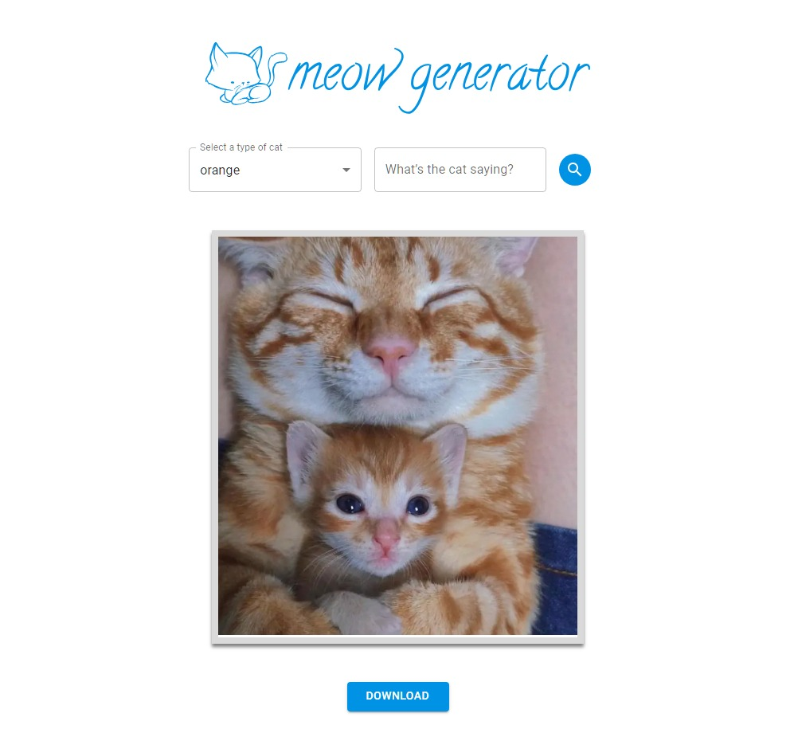

<a name="readme-top"></a>


<br />
<div align="center">

<h3 align="center">In production... Applying the Atomic Design concept.<h3>
  
  <a href="https://github.com/iNicin/meow-generator">
    
  </a>

  <h3 align="center">An interactive cat image generator</h3>

  <p align="center">
    A business challenge project
    <br />
    <a href="https://github.com/iNicin/meow-generator"><strong>Explore the docs »</strong></a>
    <br />
    <br />
    <a href="https://meow-generator.vercel.app">View Demo</a>
    ·
    <a href="https://www.figma.com/file/29YAsvexa7eIptcuFZS25U/Cat-Generator?type=design&node-id=0%3A1&mode=design&t=MahcmMoelgfSN8sk-1">View Figma Layout</a>
    ·
    <a href="https://github.com/iNicin/meow-generator/issues">Report Bug</a>
    ·
    <a href="https://github.com/iNicin/meow-generator/issues">Request Feature</a>
  </p>
</div>


<details>
  <summary>Table of Contents</summary>
  <ol>
    <li>
      <a href="#about-the-project">About The Project</a>
      <ul>
        <li><a href="#built-with">Built With</a></li>
      </ul>
    </li>
    <li>
      <a href="#getting-started">Getting Started</a>
      <ul>
        <li><a href="#prerequisites">Prerequisites</a></li>
        <li><a href="#installation">Installation</a></li>
      </ul>
    </li>
    <li><a href="#roadmap">Roadmap</a></li>
    <li><a href="#contributing">Contributing</a></li>
    <li><a href="#contact">Contact</a></li>
    <li><a href="#acknowledgments">Acknowledgments</a></li>
  </ol>
</details>


## About The Project

<br />
<br />
<a href="https://meow-generator.vercel.app">
    
</a>
<br />
<br />
How to revolutionize the world without cats? There is no way to! So, this platform allows users to create custom cat images by combining specific tags and optional text for a unique and fun experience.

<p align="right">(<a href="#readme-top">back to top</a>)</p>


### Built With

* 
* 
* 
* 
* 

Libs:
* <a href="https://mui.com/material-ui/">Material Ui<a>

<p align="right">(<a href="#readme-top">back to top</a>)</p>


<!-- GETTING STARTED -->
## Getting Started

To get a local copy up and running follow these simple steps.

### Prerequisites

* npm
  ```sh
  npm install npm@latest -g
  ```

### Installation

1. Clone the repo
   ```sh
   git clone https://github.com/iNicin/meow-generator
   ```
2. Install NPM packages
   ```sh
   npm install
   ```
3. Run
   ```sh
   npm run dev
   ```

<p align="right">(<a href="#readme-top">back to top</a>)</p>


## Roadmap

- [x] Layout inspiration - <a href="https://www.figma.com/file/29YAsvexa7eIptcuFZS25U/Cat-Generator?type=design&node-id=1%3A2&mode=design&t=MahcmMoelgfSN8sk-1">see on figma</a>
- [x] Add list of tags
- [x] Add a select input
- [x] Add optional text field
- [x] API access
- [x] Image
- [x] Generate image with tag and text
- [x] Using SEO tags and HTML accessibility
     


See the [open issues](https://github.com/iNicin/meow-generator/issues) for a full list of proposed features (and known issues).

<p align="right">(<a href="#readme-top">back to top</a>)</p>


<!-- CONTRIBUTING -->
## Contributing

Contributions are what make the open source community such an amazing place to learn, inspire, and create. Any contributions you make are **greatly appreciated**.

If you have a suggestion that would make this better, please fork the repo and create a pull request. You can also simply open an issue with the tag "enhancement".
Don't forget to give the project a star! Thanks again!

1. Fork the Project
2. Create your Feature Branch (`git checkout -b feature/AmazingFeature`)
3. Commit your Changes (`git commit -m 'Add some AmazingFeature'`)
4. Push to the Branch (`git push origin feature/AmazingFeature`)
5. Open a Pull Request

<p align="right">(<a href="#readme-top">back to top</a>)</p>


## Contact

Vinicius Ribeiro - [Linkedin](https://www.linkedin.com/in/nicin/) - vinicius.bezerra@al.resilia.com.br

Project Link: [Meow Generator](https://github.com/iNicin/meow-generator)

<p align="right">(<a href="#readme-top">back to top</a>)</p>


<!-- ACKNOWLEDGMENTS -->
## Acknowledgments

* A <a href="https://www.linkedin.com/company/thinkaigroup/">Think:AI</a> challenge!

<p align="right">(<a href="#readme-top">back to top</a>)</p>


